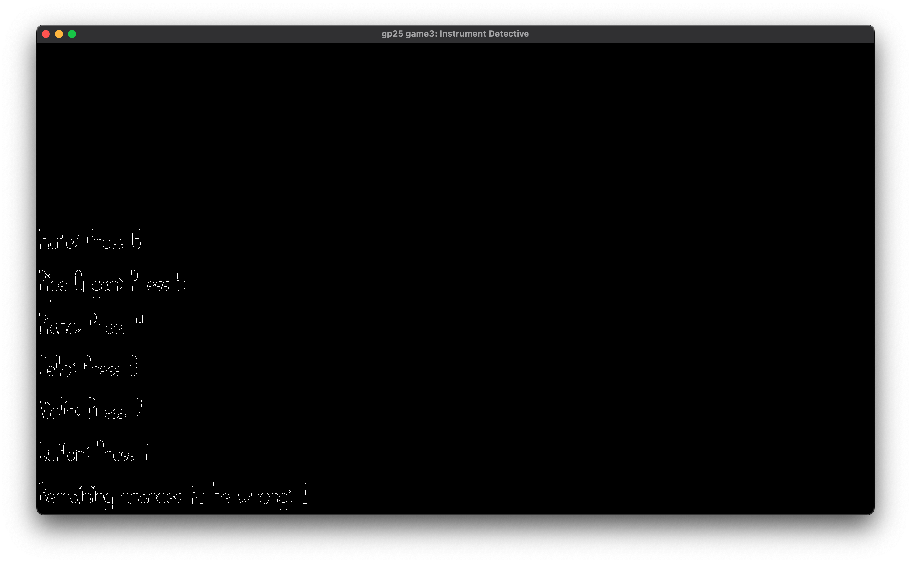

# Instrument Detective

Author: Dennis Sun

Design: My game challenges players to recognize sounds from different instruments, making it a way to reinforce familiarity with instrument timbre.

Screen Shot:

How To Play:

- The game plays different sounds made by instruments.  
- Recognize the sound and press the corresponding key shown in the window. For example, if the current sound is guitar, press key 1.  
- If the input is correct, the game will play the next sound.  
- If the input is incorrect, the game will replay the same sound.  
- The player has one chance to make an incorrect input (based on the current difficulty).  
- The player loses if no chances remain and another incorrect input is entered.  
- The player wins if all instrument sounds are recognized correctly.

This game was built with [NEST](NEST.md).
